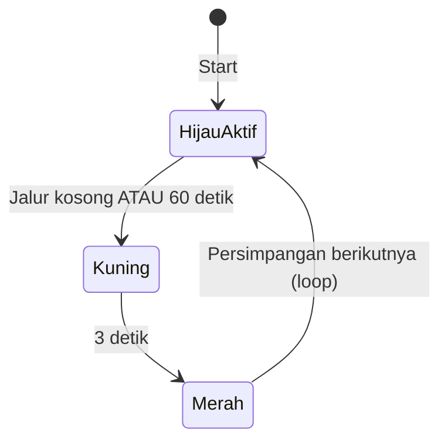

# Smart Traffic Light (ESP32)

Sistem lampu lalu lintas pintar berbasis **ESP32** dengan arsitektur **modular dan scalable**. Satu mikrokontroler dapat mengatur banyak persimpangan; penambahan jalur baru hanya memerlukan entri konfigurasi di array, tanpa mengubah logika utama.

## Fitur

- **Multi-persimpangan** — jumlah jalur dihitung otomatis dari array `intersections[]`
- **Satu hijau aktif** — hanya satu persimpangan hijau pada satu waktu
- **State machine** — `PHASE_RED`, `PHASE_YELLOW`, `PHASE_GREEN` per lampu; `CTRL_GREEN` / `CTRL_YELLOW` untuk pengontrol
- **Fungsi generik** — `setRed(index)`, `setYellow(index)`, `setGreen(index)` (tanpa hardcode per jalur)
- **Sensor HC-SR04** per persimpangan — deteksi kendaraan di jalur hijau
- **Hijau adaptif** — maksimal 60 detik; jika jalur kosong, langsung pindah ke persimpangan berikutnya
- **Transisi aman** — kuning 3 detik sebelum merah dan pergantian hijau
- **Mode idle** — jika **semua** jalur kosong (tidak ada kendaraan di sensor manapun), **semua lampu kuning** menyala; operasi hijau/merah berhenti sampai ada kendaraan

## Perangkat

| Komponen | Keterangan |
|----------|------------|
| ESP32 DevKit | Mikrokontroler utama |
| Modul traffic light 3 warna | Merah, kuning, hijau (per jalur) |
| Sensor HC-SR04 | Satu unit per persimpangan |
| Breadboard & jumper wire | Penghubungan |

## Pin default (2 persimpangan)

### Persimpangan 0

| Fungsi | GPIO |
|--------|------|
| Merah | 23 |
| Kuning | 22 |
| Hijau | 21 |
| HC-SR04 TRIG | 13 |
| HC-SR04 ECHO | 12 |

### Persimpangan 1

| Fungsi | GPIO |
|--------|------|
| Merah | 19 |
| Kuning | 18 |
| Hijau | 5 |
| HC-SR04 TRIG | 14 |
| HC-SR04 ECHO | 27 |

> Sesuaikan pin di `intersections[]` jika wiring berbeda. Hindari pin yang dipakai flash/strap pada board Anda.

## Cara kerja



1. Satu persimpangan dalam fase **hijau**; yang lain **merah**.
2. Sensor pada jalur hijau dibaca setiap **200 ms** (rata-rata 3 sampel).
3. Jika jarak ≥ **15 cm** (kosong) → transisi **kuning** 3 detik → **merah** → hijau persimpangan berikutnya.
4. Jika masih ada kendaraan (&lt; 15 cm) → hijau tetap hingga **60 detik**, lalu pindah seperti di atas.
5. Rotasi: `0 → 1 → … → N-1 → 0`.

### Mode traffic kosong (idle)

| Kondisi | Lampu |
|---------|--------|
| **Semua** sensor tidak mendeteksi kendaraan | **Semua persimpangan kuning kedip** (500 ms on/off, merah & hijau mati) |
| Ada kendaraan di **salah satu** jalur | Kembali normal: satu hijau, lainnya merah |

Sistem memindai **setiap jalur** secara berkala; bukan hanya jalur yang sedang hijau.

## Perbaikan responsivitas (v2 → v3)

**v2**

- Sensor non-blocking (satu sampel per `loop()`), cache `vehicleDetected[]`, urutan per persimpangan + jeda crosstalk.
- `MIN_GREEN_MS`, keluar idle round-robin, watchdog `activeIndex`.

**v3**

- **Ultrasonik interrupt-driven** — `attachInterrupt` + `IRAM_ATTR`; tidak ada `pulseIn()` blocking.
- **Skip jalur kosong** — `finishYellowAndActivateNext()` memakai `findFirstOccupiedIndex()`; jika semua kosong → idle.
- **Debounce idle ↔ normal** — `IDLE_CONFIRM_SCANS` (3) / `NORMAL_CONFIRM_SCANS` (2) siklus berturut.
- **`DEBUG_SERIAL`** — set `0` sebelum upload produksi untuk mematikan log sensor di hot path.
- **`constexpr MAX_INTERSECTIONS`** — batas array cache.
- **`waitForSensorCycle()`** — hanya di `setup()`; cache tetap valid setelah selesai (tanpa reset ganda).

Build produksi (Arduino IDE): tambah `-DDEBUG_SERIAL=0` di *Compiler flags* atau ubah `#define DEBUG_SERIAL 0` di awal `.ino`.

## Arsitektur kode

```
intersections[]     ← konfigurasi pin (tambah baris = tambah jalur)
       ↓
setRed / setYellow / setGreen(index)
       ↓
loop() + state machine pengontrol
```

Struct `TrafficIntersection` menyimpan pin lampu, pin sensor, dan status fase per persimpangan.

## Menambah persimpangan baru

Edit array di `smart-trafict-light.ino`:

```cpp
TrafficIntersection intersections[] = {
  { 23, 22, 21, 13, 12, PHASE_RED },  // 0
  { 19, 18,  5, 14, 27, PHASE_RED },  // 1
  { 25, 26, 27, 32, 33, PHASE_RED },  // 2 — contoh tambahan
};
```

Urutan field: `pinRed`, `pinYellow`, `pinGreen`, `pinTrig`, `pinEcho`, `PHASE_RED`.

Tidak perlu mengubah `loop()` atau fungsi transisi.

## Parameter yang bisa disesuaikan

| Konstanta | Default | Fungsi |
|-----------|---------|--------|
| `GREEN_MAX_MS` | 60000 | Durasi hijau maksimum (ms) |
| `YELLOW_DURATION_MS` | 3000 | Durasi kuning (ms) |
| `VEHICLE_THRESHOLD_CM` | 15 | Jarak &lt; nilai ini = ada kendaraan |
| `SENSOR_INTERVAL_MS` | 200 | Interval baca sensor (ms) |
| `SENSOR_SAMPLES` | 3 | Jumlah sampel untuk rata-rata |
| `IDLE_BLINK_MS` | 500 | Interval kedip kuning saat idle (ms) |
| `MIN_GREEN_MS` | 5000 | Hijau minimal sebelum boleh ganti (jalur kosong) |
| `PULSE_TIMEOUT_US` | 12000 | Timeout `pulseIn` (~200 cm, kurangi blocking) |
| `SENSOR_CROSSTALK_GAP_MS` | 25 | Jeda antar pembacaan persimpangan |
| `IDLE_CONFIRM_SCANS` | 3 | Siklus kosong berturut sebelum masuk idle |
| `NORMAL_CONFIRM_SCANS` | 2 | Siklus ada kendaraan sebelum keluar idle |

## Instalasi & upload

1. Pasang [Arduino IDE](https://www.arduino.cc/en/software) atau gunakan PlatformIO.
2. Tambahkan board **ESP32** (Board Manager: *esp32 by Espressif*).
3. Pilih board: **ESP32 Dev Module** (atau sesuai DevKit Anda).
4. Buka folder/sketch `smart-trafict-light.ino`.
5. Hubungkan ESP32 via USB, pilih port COM, lalu **Upload**.

### Serial Monitor

- Baud rate: **115200**
- Log menampilkan jumlah persimpangan, status sensor, dan pergantian fase.

## Wiring singkat

- **Lampu**: GPIO ESP32 → modul traffic light (perhatikan common anode/cathode dan level 3,3 V).
- **HC-SR04**: VCC 5 V (jika modul butuh 5 V), GND bersama ESP32, TRIG/ECHO ke GPIO yang dikonfigurasi. Untuk ECHO 5 V ke ESP32, gunakan pembagi tegangan atau level shifter.

## Troubleshooting

| Masalah | Solusi |
|---------|--------|
| Lampu tidak menyala | Beberapa modul **active-LOW** — balik logika di `writeLightPins()` (`HIGH` ↔ `LOW`). |
| Sensor selalu “ADA kendaraan” | Cek jarak ambang, halangan di depan sensor, atau kabel TRIG/ECHO tertukar. |
| Sensor gagal baca | Sistem menganggap masih ada kendaraan (lebih aman); periksa daya dan koneksi ECHO. |
| Hanya satu jalur | Pastikan minimal 2 entri di `intersections[]` jika ingin rotasi antar-jalur. |

## Lisensi

Proyek akademik IoT — bebas digunakan dan dimodifikasi untuk keperluan pembelajaran.
